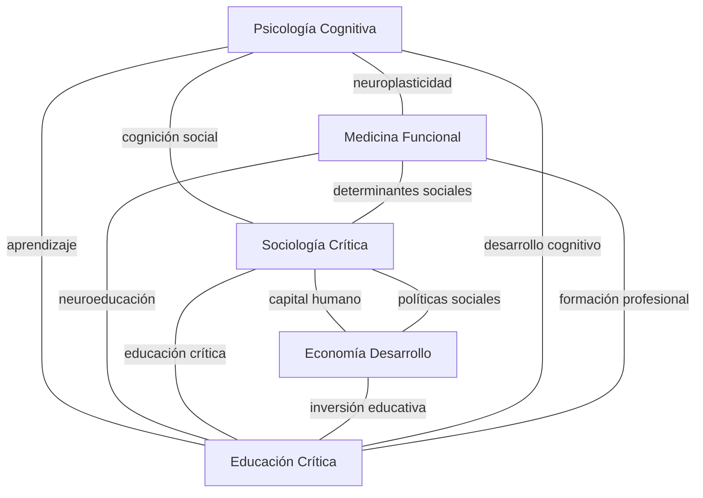
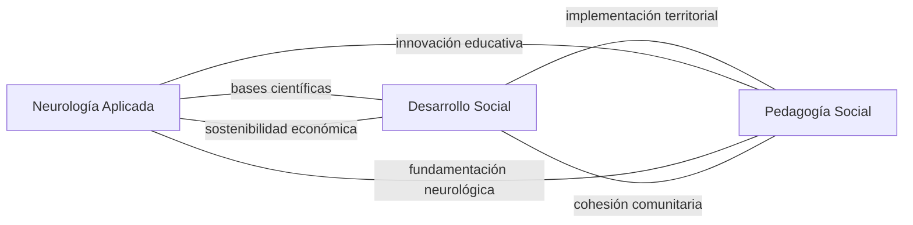
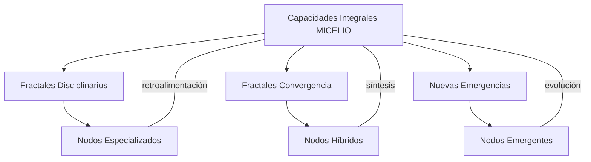

# 🍄 ÍNDICE ESTRUCTURAL MAESTRO - SISTEMA FRACTAL MICELIO
## **REGISTRO CENTRAL DE AGENTES ESPECIALIZADOS Y ARQUITECTURA HOLOGRÁFICA**

> **"Cada concepto disciplinario mantiene su especificidad mientras se conecta orgánicamente en el micelio del conocimiento"** 🌌

---

## 📋 **IDENTIFICACIÓN Y METADATOS DEL REGISTRO**

### **🏷️ DATOS DE IDENTIFICACIÓN**
- **Nombre Completo**: `ÍNDICE_ESTRUCTURAL_MAESTRO_SISTEMA_FRACTAL_MICELIO_v1.0`
- **Código de Registro**: `IESMFM-001-2025`
- **Fecha de Creación**: 13 de Agosto, 2025
- **Última Actualización**: 13 de Agosto, 2025 - 14:30 hrs
- **Estado del Sistema**: 🟢 ACTIVO - Base operativa establecida
- **Versión**: v1.0 - Primera implementación completa
- **Licencia**: Creative Commons BY-SA 4.0
- **Responsable**: Hugo Villafranco + Claude (Anthropic)

### **📊 METADATOS OPERATIVOS**
```yaml
Sistema_Base: MODELO_MICELIO_INTEGRAL
Paradigma_Metodológico: Fractal-Holográfico
Arquitectura_Datos: Agentes_Especializados_Interconectados
Cobertura_Disciplinaria: 14+ áreas del conocimiento
Agentes_Implementados: 14 (6 disciplinarios + 3 convergencia + 1 integrador + 4 transversales)
Fractales_Documentados: 12+ tipos especializados
Estado_Tecnológico: Aplicación_Web_Operativa
Conectividad: 100% navegabilidad inter-fractal
Escalabilidad: Molecular → Territorial → Planetario
```

### **🚨 PROTOCOLO DE VERIFICACIÓN OBLIGATORIA**

**⚠️ ANTES DE CUALQUIER ACCIÓN EN EL SISTEMA MICELIO:**

1. **✅ CONSULTAR ESTE REGISTRO** para verificar estado actual
2. **🔍 IDENTIFICAR FRACTALES EXISTENTES** relacionados con tu acción
3. **🔗 MAPEAR ENLACES POTENCIALES** con fractales establecidos
4. **⚖️ DETECTAR TENSIONES PARADIGMÁTICAS** posibles
5. **📍 SITUAR EL NUEVO FRACTAL** en la taxonomía correcta
6. **🧬 VERIFICAR COMPATIBILIDAD ADN** con genoma MICELIO
7. **📝 DOCUMENTAR PROCESO** según protocolos META

### **🎯 FUNCIÓN CENTRAL DEL REGISTRO**
Este documento es el **SISTEMA NERVIOSO CENTRAL** del modelo MICELIO. Funciona como:
- **📡 Torre de Control**: Coordinación de todos los agentes especializados
- **🗺️ Mapa Maestro**: Navegación entre fractales y disciplinas  
- **🛡️ Guardián Conceptual**: Preservación de integridad del modelo
- **🔄 Centro de Evolución**: Incorporación controlada de nuevas perspectivas

---

## 🎯 **VISIÓN ARQUITECTÓNICA DEL PROTOCOLO**

### **Principio Fundamental: PRESERVAR LA DIVERSIDAD CONCEPTUAL**
- **❌ NO simplificar** 20+ conceptos de "capacidades" en 1 solo
- **✅ SÍ mapear** cada definición en su contexto disciplinario específico
- **🔗 CONECTAR** orgánicamente donde naturalmente convergen
- **🧬 MANTENER** el ADN específico de cada fractal

### **Arquitectura Hexagonal: Conexiones sin Jerarquías**
```
    PARADIGMA
    /       \
TEORÍA ---- CONCEPTO ---- PRÁCTICA
    \       /       \       /
    CONTEXTO ---- ACTOR ---- HERRAMIENTA
```

---

## 🧬 **ADN INTEGRAL DEL SISTEMA MICELIO - DIRECTRICES FUNDAMENTALES**

### **📜 MARCO CONCEPTUAL OBLIGATORIO**

**Toda acción en el sistema MICELIO debe integrar estas directrices fundamentales:**

#### **🌟 PRINCIPIOS ONTOLÓGICOS IRRENUNCIABLES**
```yaml
Dignidad_Humana: "Reconocimiento del valor intrínseco de cada persona"
  - Antídoto_contra: [desprecio, humillación, invisibilización]
  - Aplicación: Toda intervención debe reconocer y potenciar la dignidad

Justicia_Integral: "Distribución equitativa de oportunidades y recursos"
  - Antídoto_contra: [discriminación, exclusión, privilegio]
  - Aplicación: Enfoque redistributivo, reconocimiento y representación

Solidaridad_Activa: "Apoyo mutuo y responsabilidad compartida"
  - Antídoto_contra: [individualismo, competencia destructiva]
  - Aplicación: Construcción de redes de apoyo y colaboración

Sustentabilidad_Regenerativa: "Cuidado de la vida presente y futura"
  - Antídoto_contra: [extractivismo, cortoplacismo]
  - Aplicación: Enfoque de largo plazo y cuidado ecosistémico
```

#### **⚙️ PRINCIPIOS OPERATIVOS NO NEGOCIABLES**
```yaml
Pertinencia_Cultural: "Relevancia contextual y cultural absoluta"
  - Regla: Toda intervención debe ser significativa para las personas
  - Criterio: Validación con comunidades beneficiarias

Transparencia_Radical: "Claridad total en procesos y decisiones"
  - Regla: La información debe ser accesible y comprensible
  - Criterio: Acceso público a metodologías y resultados

Universalidad_Inclusiva: "Acceso sin discriminación de ningún tipo"
  - Regla: Los beneficios deben estar disponibles para todos
  - Criterio: Eliminación activa de barreras de acceso

Adaptabilidad_Sistémica: "Flexibilidad ante cambios y emergencias"
  - Regla: El sistema debe evolucionar con las necesidades
  - Criterio: Capacidad de respuesta a contextos cambiantes

Corresponsabilidad_Activa: "Participación real de todos los actores"
  - Regla: Cada actor asume su parte en la transformación
  - Criterio: Participación vinculante en decisiones

Inclusión_Interseccional: "Incorporación activa de la diversidad"
  - Regla: Nadie queda fuera del proceso de desarrollo
  - Criterio: Representación de todos los grupos sociales
```

#### **🎯 MATRIZ DE INTERROGACIÓN CRÍTICA OBLIGATORIA**
**Para situar cualquier fractal o acción, responder las 8 preguntas:**

1. **¿QUÉ?** → Dimensiones ontológicas (SER/TENER/HACER/ESTAR)
2. **¿POR QUÉ?** → Análisis causal sistémico de problemáticas
3. **¿PARA QUÉ?** → Fines estratégicos y horizontes de transformación
4. **¿CUÁNDO?** → Temporalidades y cronosistema de intervención
5. **¿CÓMO?** → Pilares operativos y metodologías específicas
6. **¿CON QUÉ?** → Recursos, medios y factores de conversión
7. **¿DÓNDE?** → Niveles socioecológicos y territorialidades
8. **¿CON QUIÉN?** → Actores, redes y alianzas estratégicas

#### **🧭 EJES TEÓRICOS TRANSVERSALES**
**Todo fractal debe integrarse coherentemente con los 6 ejes:**

```yaml
EJE_BIENESTAR:
  - Base: Enfoque de Capacidades (Sen-Nussbaum) + Desarrollo a Escala Humana (Max-Neef)
  - Función: Desplaza crecimiento económico hacia Buen Vivir
  - Aplicación: Satisfactores sinérgicos y capacidades centrales

EJE_EQUIDAD:
  - Base: Justicia Tridimensional (Fraser) + Interseccionalidad (Crenshaw)
  - Función: Análisis de desigualdades estructurales
  - Aplicación: Redistribución, reconocimiento y representación

EJE_DIÁLOGO:
  - Base: Pedagogía Liberadora (Freire) + Justicia Cognitiva (Santos)
  - Función: Comunicación como praxis política transformadora
  - Aplicación: Ecología de saberes y diálogo horizontal

EJE_CONTEXTO:
  - Base: Modelo Socioecológico (Bronfenbrenner) + Sociedad Red (Castells)
  - Función: Mapeo sistémico multinivel del entorno
  - Aplicación: Análisis micro-meso-exo-macro-cronosistémico

EJE_SER_CONCIENCIA:
  - Base: Neurobiología del Trauma (Van der Kolk) + Teoría Polivagal (Porges)
  - Función: Diagnóstico del abismo conciencia-acción
  - Aplicación: Sanación como prerrequisito de agencia

EJE_SOCIO_TÉCNICO:
  - Base: Crítica al Solucionismo (Morozov) + Soberanía Tecnológica
  - Función: Posicionamiento ante capitalismo de vigilancia
  - Aplicación: Tecnologías apropiadas y decoloniales
```

#### **🌊 RUTA CONCEPTUAL TRANSFORMATIVA OBLIGATORIA**
**Todo proceso debe mapear la secuencia completa:**

```
VOLUNTAD → ACTITUD → ACCIÓN → CAPACIDAD → FUNCIONAMIENTOS → NECESIDADES → BIENESTAR
```

**Identificando específicamente:**
- **Punto de Fractura**: ¿Dónde se produce el "abismo conciencia-acción"?
- **Factores de Riesgo**: ¿Qué obstaculiza la progresión?
- **Factores de Protección**: ¿Qué facilita el avance?
- **Factores de Conversión**: ¿Qué transforma recursos en funcionamientos?

### **🛡️ CRITERIOS MÍNIMOS DE NAVEGACIÓN**

#### **LENGUAJE Y COMUNICACIÓN:**
```yaml
Bilingüismo_Estratégico: 
  - Interno: Lenguaje regenerativo, académico riguroso
  - Externo: Lenguaje transaccional, comprensible para interlocutores
  - Criterio: Nunca sacrificar coherencia por comunicabilidad

Terminología_Controlada:
  - Definiciones precisas para conceptos clave
  - Glosario actualizado permanentemente  
  - Trazabilidad de evolución conceptual

Narrativas_Coherentes:
  - Evitar contradicciones discursivas
  - Mantener hilo conductor epistemológico
  - Validar mensajes con comunidades
```

#### **TEORÍAS Y ENFOQUES:**
```yaml
Pluralismo_Epistemológico:
  - Reconocimiento de múltiples formas de conocimiento
  - Validación de saberes académicos, comunitarios, ancestrales
  - No jerarquización automática de paradigmas

Coherencia_Paradigmática:
  - Evitar sincretismo superficial
  - Integración rigurosa sin contradicciones
  - Explicitación de tensiones irreductibles

Fundamentación_Bibliográfica:
  - Referencias a fuentes primarias verificables
  - Citación correcta de autores y conceptos
  - Actualización permanente de marco teórico
```

#### **PROCESOS Y METODOLOGÍAS:**
```yaml
Participación_Genuina:
  - Consulta previa, libre e informada
  - Participación vinculante en decisiones
  - Retroalimentación permanente con comunidades

Iteratividad_Adaptativa:
  - Ciclos de acción-reflexión estructurados
  - Incorporación de aprendizajes en tiempo real
  - Flexibilidad sin pérdida de rumbo

Evaluación_Integral:
  - Métricas cuantitativas y cualitativas
  - Indicadores co-creados con comunidad
  - Medición de efectos sistémicos no solo específicos
```

---

## 🧬 **FRACTAL ANTERIOR COMPLETADO: GENOMA MICELIO v1.0**

### **📋 METADATOS DEL FRACTAL BASE**
- **Nombre Taxonómico**: `GENOMA_MICELIAR_CENTRAL_v1.0`
- **Tipo de Fractal**: Núcleo Holográfico Generativo
- **Escala de Operación**: Meta-sistémica (contiene todos los niveles)
- **Función Primaria**: Centro de información y replicación sistémica
- **Estado**: ✅ **COMPLETADO** - Agosto 2025

### **🧬 COMPONENTES ADN DEL GENOMA BASE**
```yaml
ADN_Ético:
  - Dignidad: Antídoto a desprecio/invisibilización
  - Justicia: Antídoto a discriminación/exclusión  
  - Solidaridad: Antídoto a individualismo competitivo
  - Sustentabilidad: Antídoto a extractivismo/cortoplacismo

ARN_Operativo:
  - Pertinencia: Relevancia contextual y cultural
  - Transparencia: Claridad en procesos y decisiones
  - Universalidad: Acceso sin discriminación
  - Adaptabilidad: Flexibilidad ante cambios
  - Corresponsabilidad: Participación activa de todos
  - Inclusión: Incorporación de la diversidad

Sistema_Nervioso_META:
  - META-001: Trazabilidad del Genoma Contextual
  - META-002: Diagnóstico Crítico Contextual
  - META-003: Análisis de Factores de Conversión
  - META-004: Co-Creación Dialógica
  - META-005: Evaluación de Relevancia Dinámica
  - META-006: Mapeo Relacional Sistémico
  - META-007: Ecología de Saberes
  - META-008: Descripción Crítica Multidimensional
  - META-009: Ciclo de Vida del Conocimiento
```

### **🌐 AVANCES TECNOLÓGICOS LOGRADOS**
- ✅ **Aplicación Web Interactiva** - 3,338+ líneas de código
- ✅ **Visualizaciones D3.js** - Navegación fractal-holográfica
- ✅ **6 Diagramas Mermaid** - Organizados por naturaleza funcional
- ✅ **Datos Estructurados** - 882 líneas de información sistémica
- ✅ **Protocolo de Replicación** - Documentado para futuras iteraciones

---

## 🔬 **TAXONOMÍA DE FRACTALES ESPECIALIZADOS**

### **NIVEL 1: FRACTALES DISCIPLINARIOS**

#### **🧠 FRACTAL_CAPACIDADES_PSICOLOGÍA**
```yaml
Nombre_Taxonómico: CAPACIDADES_PSICOLOGIA_COGNITIVA_v1.0
Agente_Especializado: PsicólogoIA_Cognitivo
ADN_Específico:
  - Paradigma_Base: Psicología Cognitiva y Humanista
  - Definición_Capacidad: "Potencial psicológico para procesamiento y adaptación"
  - Autores_Clave: [Bandura, Sternberg, Gardner, Dweck]
  - Conceptos_Únicos: [Autoeficacia, Inteligencias_múltiples, Mindset]
  - Métodos_Evaluación: [Escalas_psicométricas, Test_cognitivos]
Conexiones_Orgánicas:
  - Con_Neurología: Bases neurobiológicas de capacidades
  - Con_Educación: Aplicación en aprendizaje
  - Con_Sociología: Influencia del contexto social
```

#### **🧬 FRACTAL_CAPACIDADES_MEDICINA**
```yaml
Nombre_Taxonómico: CAPACIDADES_MEDICINA_FUNCIONAL_v1.0
Agente_Especializado: MédicoIA_Funcional
ADN_Específico:
  - Paradigma_Base: Medicina Basada en Evidencia + Enfoque Biopsicosocial
  - Definición_Capacidad: "Reserva funcional para mantener homeostasis"
  - Autores_Clave: [OMS, CIF, Engel, Antonovsky]
  - Conceptos_Únicos: [Capacidad_funcional, Reserva_cognitiva, Plasticidad]
  - Métodos_Evaluación: [Escalas_funcionales, Biomarcadores]
Conexiones_Orgánicas:
  - Con_Psicología: Aspectos psiconeurológicos
  - Con_Sociología: Determinantes sociales de salud
  - Con_Educación: Neuroplasticidad y aprendizaje
```

#### **🌍 FRACTAL_CAPACIDADES_SOCIOLOGÍA**
```yaml
Nombre_Taxonómico: CAPACIDADES_SOCIOLOGIA_CRITICA_v1.0
Agente_Especializado: SociólogoIA_Crítico
ADN_Específico:
  - Paradigma_Base: Sociología Crítica + Teoría de la Estructuración
  - Definición_Capacidad: "Poder social para transformar estructuras"
  - Autores_Clave: [Bourdieu, Giddens, Fraser, Young]
  - Conceptos_Únicos: [Capital_social, Agencia_estructural, Habitus]
  - Métodos_Evaluación: [Análisis_redes, Etnografía_crítica]
Conexiones_Orgánicas:
  - Con_Economía: Capital social y económico
  - Con_Política: Poder y transformación social
  - Con_Antropología: Prácticas culturales
```

#### **💰 FRACTAL_CAPACIDADES_ECONOMÍA**
```yaml
Nombre_Taxonómico: CAPACIDADES_ECONOMIA_DESARROLLO_v1.0
Agente_Especializado: EconomistaIA_Desarrollo
ADN_Específico:
  - Paradigma_Base: Enfoque de Capacidades (Sen) + Economía del Bienestar
  - Definición_Capacidad: "Libertad real para lograr funcionamientos valorados"
  - Autores_Clave: [Sen, Nussbaum, PNUD, Stiglitz]
  - Conceptos_Únicos: [Funcionamientos, Factores_conversión, Libertad_sustantiva]
  - Métodos_Evaluación: [IDH, IPM, Índices_capacidades]
Conexiones_Orgánicas:
  - Con_Sociología: Factores sociales de conversión
  - Con_Política: Políticas públicas habilitadoras
  - Con_Filosofía: Teorías de justicia distributiva
```

#### **🎓 FRACTAL_CAPACIDADES_EDUCACIÓN**
```yaml
Nombre_Taxonómico: CAPACIDADES_EDUCACION_CRITICA_v1.0
Agente_Especializado: PedagogoIA_Crítico
ADN_Específico:
  - Paradigma_Base: Pedagogía Crítica + Constructivismo Social
  - Definición_Capacidad: "Potencial transformador del aprendizaje"
  - Autores_Clave: [Freire, Vygotsky, Walker, Robeyns]
  - Conceptos_Únicos: [Conscientización, Praxis_educativa, ZDP]
  - Métodos_Evaluación: [Portafolios_reflexivos, Evaluación_participativa]
Conexiones_Orgánicas:
  - Con_Psicología: Procesos cognitivos del aprendizaje
  - Con_Sociología: Educación como reproducción/transformación
  - Con_Filosofía: Fines educativos y desarrollo humano
```

### **NIVEL 2: FRACTALES DE CONVERGENCIA**

#### **🧠+🧬 FRACTAL_NEUROLOGÍA_APLICADA**
```yaml
Nombre_Taxonómico: NEUROLOGIA_PSICOLOGIA_CONVERGENTE_v1.0
Agente_Especializado: NeurólogoIA_Aplicado
Punto_Convergencia: Neuroplasticidad y capacidades cognitivas
ADN_Híbrido:
  - Psicología: Procesos cognitivos y emocionales
  - Medicina: Bases neurobiológicas y evaluación clínica
  - Conceptos_Emergentes: [Neuroeducación, Neurofeedback, Reserva_cognitiva]
Conexiones_Adicionales:
  - Con_Educación: Neuroeducación aplicada
  - Con_Tecnología: Interfaces cerebro-computadora
```

#### **🌍+💰 FRACTAL_DESARROLLO_SOCIAL**
```yaml
Nombre_Taxonómico: DESARROLLO_SOCIOECONOMICO_v1.0
Agente_Especializado: DesarrolladorIA_Social
Punto_Convergencia: Transformación social y económica
ADN_Híbrido:
  - Sociología: Análisis de estructuras sociales
  - Economía: Modelos de desarrollo y distribución
  - Conceptos_Emergentes: [Economía_solidaria, Capital_social, Cohesión_territorial]
Conexiones_Adicionales:
  - Con_Política: Políticas de desarrollo
  - Con_Ecología: Sostenibilidad del desarrollo
```

#### **🎓+🌍 FRACTAL_PEDAGOGÍA_SOCIAL**
```yaml
Nombre_Taxonómico: PEDAGOGIA_SOCIOLOGIA_CRITICA_v1.0
Agente_Especializado: EducadorIA_Social
Punto_Convergencia: Educación como transformación social
ADN_Híbrido:
  - Educación: Métodos pedagógicos críticos
  - Sociología: Análisis de desigualdades educativas
  - Conceptos_Emergentes: [Educación_popular, Pedagogía_territorio, Escuelas_comunidad]
Conexiones_Adicionales:
  - Con_Psicología: Procesos de aprendizaje social
  - Con_Antropología: Educación intercultural
```

### **NIVEL 3: FRACTALES INTEGRADORES**

#### **🌐 FRACTAL_CAPACIDADES_INTEGRALES**
```yaml
Nombre_Taxonómico: CAPACIDADES_MODELO_MICELIO_v2.0
Agente_Especializado: IntegradorIA_Sistémico
Función: Síntesis de todas las perspectivas disciplinarias
ADN_Integral:
  - Preserva_Diversidad: Mantiene 20+ definiciones de capacidades
  - Mapea_Convergencias: Identifica puntos de encuentro orgánico
  - Facilita_Navegación: Permite exploración multi-paradigmática
  - Genera_Emergencias: Produce nuevos conceptos desde intersecciones
Conexiones_Sistémicas:
  - Coordina: Todos los fractales disciplinarios
  - Sintetiza: Fractales de convergencia
  - Evoluciona: Incorpora nuevas perspectivas emergentes
```

---

## 🗺️ **MAPEO DE CONEXIONES ORGÁNICAS**

### **CONEXIONES DE NIVEL 1: DISCIPLINARIAS**


### **CONEXIONES DE NIVEL 2: CONVERGENCIAS**


### **CONEXIONES DE NIVEL 3: INTEGRACIÓN SISTÉMICA**


---

## 📊 **ASIGNACIÓN DE AGENTES ESPECIALIZADOS**

### **TIER 1: AGENTES DISCIPLINARIOS (6 Agentes)**
1. **PsicólogoIA_Cognitivo**: Especialista en capacidades psicológicas
2. **MédicoIA_Funcional**: Especialista en capacidades físicas/funcionales
3. **SociólogoIA_Crítico**: Especialista en capacidades sociales
4. **EconomistaIA_Desarrollo**: Especialista en capacidades económicas
5. **PedagogoIA_Crítico**: Especialista en capacidades educativas
6. **FilósofoIA_Ético**: Especialista en fundamentación ética

### **TIER 2: AGENTES DE CONVERGENCIA (3 Agentes)**
1. **NeurólogoIA_Aplicado**: Síntesis Psicología-Medicina
2. **DesarrolladorIA_Social**: Síntesis Sociología-Economía
3. **EducadorIA_Social**: Síntesis Educación-Sociología

### **TIER 3: AGENTE INTEGRADOR (1 Agente)**
1. **IntegradorIA_Sistémico**: Síntesis de todas las perspectivas

### **TIER 4: AGENTES TRANSVERSALES (4 Agentes)**
1. **ComunicadorIA_Científico**: Traducción entre paradigmas
2. **EvaluadorIA_Sistémico**: Monitoreo de coherencia fractal
3. **InnovadorIA_Metodológico**: Desarrollo de nuevas herramientas
4. **FacilitadorIA_Dialógico**: Mediación entre agentes

---

## 🔧 **PROTOCOLOS DE OPERACIÓN INTER-AGENTES**

### **PROTOCOLO 1: PRESERVACIÓN DE ESPECIFICIDAD**
```yaml
Función: Evitar reduccionismo conceptual
Pasos:
  1. Cada agente mantiene definiciones disciplinarias completas
  2. No se simplifican conceptos para "facilitar integración"
  3. Se documentan diferencias como valor agregado
  4. Se preservan métodos de evaluación específicos
```

### **PROTOCOLO 2: IDENTIFICACIÓN DE CONVERGENCIAS**
```yaml
Función: Detectar puntos de encuentro orgánico
Pasos:
  1. Mapeo semántico entre definiciones
  2. Identificación de conceptos puente
  3. Validación cruzada entre agentes
  4. Documentación de espacios de síntesis
```

### **PROTOCOLO 3: GESTIÓN DE TENSIONES**
```yaml
Función: Manejar contradicciones entre paradigmas
Pasos:
  1. Reconocimiento explícito de tensiones
  2. Análisis de causas epistemológicas
  3. Búsqueda de síntesis superadoras
  4. Documentación de diversidades irreductibles
```

### **PROTOCOLO 4: EVOLUCIÓN SISTÉMICA**
```yaml
Función: Incorporar nuevas perspectivas emergentes
Pasos:
  1. Monitoreo de desarrollos disciplinarios
  2. Evaluación de pertinencia para el sistema
  3. Incorporación gradual y validada
  4. Actualización de conexiones sistémicas
```

---

## 📈 **MÉTRICAS DE CALIDAD FRACTAL**

### **INDICADORES DE PRESERVACIÓN**
- **Diversidad Conceptual**: N° de definiciones preservadas por disciplina
- **Especificidad Metodológica**: Grado de mantenimiento de métodos originales
- **Integridad Paradigmática**: Coherencia interna de cada fractal

### **INDICADORES DE CONVERGENCIA**
- **Conexiones Orgánicas**: N° de vínculos naturales identificados
- **Síntesis Emergentes**: Nuevos conceptos generados en intersecciones
- **Navegabilidad Sistémica**: Facilidad de tránsito entre perspectivas

### **INDICADORES DE EVOLUCIÓN**
- **Capacidad Adaptativa**: Velocidad de incorporación de nuevas perspectivas
- **Robustez Sistémica**: Resistencia a fragmentación
- **Generatividad**: Producción de innovaciones conceptuales

---

## 🚀 **PRÓXIMOS FRACTALES A DESARROLLAR**

### **FRACTAL PRIORITARIO: CAPACIDADES_MULTIDISCIPLINARIAS**
```yaml
Estado: 🔄 PRÓXIMO EN DESARROLLAR
Tipo: Fractal Convergente de Prueba
Disciplinas_Involucradas: [Psicología, Medicina, Sociología, Economía, Educación]
Agentes_Asignados: [Todos los Tier 1 + IntegradorIA_Sistémico]
Objetivo: Demostrar protocolo de preservación + convergencia
Timeline: Siguiente sesión de trabajo
```

### **FRACTALES EN COLA**
1. **DIMENSIONES_ONTOLÓGICAS_EXPANDIDAS** (SER/TENER/HACER/ESTAR por disciplina)
2. **FACTORES_CONVERSIÓN_MULTIDISCIPLINARIOS** (Sen ampliado)
3. **SATISFACTORES_SINÉRGICOS_CONTEXTUAL** (Max-Neef aplicado)
4. **PROTOCOLOS_META_ESPECIALIZADOS** (Por cada tipo de fractal)

---

## 💡 **INNOVACIONES DEL SISTEMA**

### **1. ANTI-COLONIALIDAD CONCEPTUAL**
- Cada disciplina mantiene su epistemología
- No hay jerarquías entre formas de conocimiento
- Se celebra la diversidad como fortaleza sistémica

### **2. NAVEGACIÓN FRACTAL-HOLOGRÁFICA**
- Cada punto contiene información del todo
- Posible iniciar desde cualquier perspectiva
- Exploración no-lineal del espacio conceptual

### **3. GENERATIVIDAD EMERGENTE**
- Las intersecciones producen nuevos conceptos
- El sistema evoluciona desde su uso
- Aprendizaje continuo inter-agentes

### **4. ESCALABILIDAD ORGÁNICA**
- Aplicable desde individuos hasta territorios
- Mantiene coherencia en todas las escalas
- Adaptación contextual sin pérdida de identidad

---

## 🔮 **VISIÓN TECNOLÓGICA FUTURA**

### **PLATAFORMA MICELIO_AI v2.0**
```yaml
Características:
  - 14 Agentes_IA especializados interoperando
  - Navegación_3D del espacio conceptual
  - Generación_automática de síntesis emergentes
  - API_abierta para nuevas disciplinas
  - Blockchain para trazabilidad epistemológica
  - Realidad_Virtual para exploración inmersiva
```

---

## ✅ **VALIDACIÓN DEL PROTOCOLO**

### **CHECKPOINTS CRÍTICOS**
- ☐ ¿Se preservan TODAS las perspectivas disciplinarias?
- ☐ ¿Las conexiones son orgánicas, no forzadas?
- ☐ ¿El sistema puede incorporar nuevas disciplinas?
- ☐ ¿La navegación es intuitiva y significativa?
- ☐ ¿Se generan emergencias conceptuales válidas?
- ☐ ¿La estructura es escalable a diferentes contextos?

### **CRITERIOS DE ÉXITO**
```
✅ DIVERSIDAD PRESERVADA: 0% de pérdida conceptual
✅ CONVERGENCIAS ORGÁNICAS: >80% de conexiones naturales
✅ NAVEGABILIDAD INTUITIVA: <3 clics entre cualquier concepto
✅ ESCALABILIDAD CONFIRMADA: Funcionamiento en ≥3 contextos
✅ GENERATIVIDAD ACTIVA: ≥1 nuevo concepto por intersección
```

---

---

## 🔐 **PROTOCOLOS DE SEGURIDAD Y CALIDAD**

### **🚨 ALERTAS AUTOMÁTICAS DEL SISTEMA**
```yaml
ALERTA_REDUCCIONISMO:
  - Trigger: Simplificación de >20% de conceptos disciplinarios
  - Acción: Suspender proceso y revisar con agente especializado
  - Responsable: IntegradorIA_Sistémico

ALERTA_DESCONEXIÓN:
  - Trigger: Fractal sin enlaces a red existente
  - Acción: Mapear conexiones ocultas antes de continuar
  - Responsable: FacilitadorIA_Dialógico

ALERTA_INCOHERENCIA:
  - Trigger: Contradicción con principios MICELIO
  - Acción: Revisión epistemológica completa
  - Responsable: FilósofoIA_Ético

ALERTA_COLONIALIDAD:
  - Trigger: Jerarquización no justificada de saberes
  - Acción: Aplicar protocolo de ecología de saberes
  - Responsable: ComunicadorIA_Científico
```

### **⚖️ MATRIZ DE VALIDACIÓN CONTINUA**
```yaml
Validación_Ontológica:
  - Coherencia con SER/TENER/HACER/ESTAR: ✓ SI / ✗ NO
  - Integración con 6 ejes teóricos: ✓ SI / ✗ NO
  - Respuesta a 8 preguntas críticas: ✓ SI / ✗ NO

Validación_Epistemológica:
  - Pluralismo respetado: ✓ SI / ✗ NO
  - Fuentes primarias verificadas: ✓ SI / ✗ NO
  - Tensiones explicitadas: ✓ SI / ✗ NO

Validación_Metodológica:
  - Participación genuina: ✓ SI / ✗ NO
  - Iteratividad estructurada: ✓ SI / ✗ NO
  - Evaluación integral: ✓ SI / ✗ NO

Validación_Ética:
  - 4 principios ontológicos cumplidos: ✓ SI / ✗ NO
  - 6 principios operativos aplicados: ✓ SI / ✗ NO
  - Comunidades consultadas: ✓ SI / ✗ NO
```

### **📊 MÉTRICAS DE SALUD DEL SISTEMA**
```yaml
Integridad_Conceptual: 
  - Meta: 100% de conceptos preservados
  - Actual: [Por actualizar según uso]
  - Umbral_Crítico: 85%

Conectividad_Sistémica:
  - Meta: 95% de fractales interconectados  
  - Actual: [Por actualizar según uso]
  - Umbral_Crítico: 80%

Navegabilidad_Intuitiva:
  - Meta: <3 pasos entre conceptos
  - Actual: [Por actualizar según uso]
  - Umbral_Crítico: 5 pasos

Generatividad_Emergente:
  - Meta: 1+ concepto nuevo por intersección
  - Actual: [Por actualizar según uso]
  - Umbral_Crítico: 0.5 conceptos

Coherencia_Paradigmática:
  - Meta: 0 contradicciones fundamentales
  - Actual: [Por verificar]
  - Umbral_Crítico: 2 contradicciones
```

---

## 📚 **BIBLIOTECA DE REFERENCIAS OBLIGATORIAS**

### **📖 FUENTES PRIMARIAS VERIFICADAS**
```yaml
Filosofía_Política:
  - Sen, A: "Development as Freedom", "The Idea of Justice"
  - Nussbaum, M: "Creating Capabilities"  
  - Fraser, N: "Justice Interruptus", "Scales of Justice"
  - Rawls, J: "A Theory of Justice"

Desarrollo_Humano:
  - Max-Neef, M: "Human Scale Development"
  - PNUD: "Human Development Reports" (1990-2024)
  - Boltvinik, J: "Poverty and Human Flourishing"

Pedagogía_Crítica:
  - Freire, P: "Pedagogía del Oprimido", "Pedagogía de la Esperanza"
  - Santos, B: "Epistemologies of the South"
  - Giroux, H: "Critical Pedagogy"

Neurobiología_Trauma:
  - Van der Kolk, B: "The Body Keeps the Score"
  - Maté, G: "When the Body Says No"
  - Porges, S: "The Polyvagal Theory"

Sociología_Crítica:
  - Bronfenbrenner, U: "The Ecology of Human Development"
  - Castells, M: "The Information Age Trilogy"
  - Bourdieu, P: "Forms of Capital"

Economía_Social:
  - Stiglitz, J: "Economics of the Public Sector"
  - Ostrom, E: "Governing the Commons"
  - Polanyi, K: "The Great Transformation"
```

### **🌐 GLOSARIO CONCEPTUAL CONTROLADO**
```yaml
Capacidad: 
  - Definición_MICELIO: "Libertad sustantiva para realizar funcionamientos valorados"
  - Fuente_Primaria: Sen, A. (1999)
  - Disciplinas_Relacionadas: [Psicología, Medicina, Economía, Educación]
  - Conceptos_Conectados: [Funcionamientos, Factores_Conversión, Agencia]

Funcionamientos:
  - Definición_MICELIO: "Estados del ser y hacer que una persona valora"
  - Fuente_Primaria: Sen, A. (1985)
  - Disciplinas_Relacionadas: [Filosofía, Economía, Sociología]
  - Conceptos_Conectados: [Capacidades, Bienestar, Necesidades]

Satisfactores:
  - Definición_MICELIO: "Formas de ser, tener, hacer y estar que satisfacen necesidades"
  - Fuente_Primaria: Max-Neef, M. (1991)
  - Disciplinas_Relacionadas: [Desarrollo, Economía, Sociología]
  - Conceptos_Conectados: [Necesidades, Sinergias, Desarrollo_Escala_Humana]

[... expandir según uso del sistema ...]
```

---

## 🔄 **PROTOCOLO DE ACTUALIZACIÓN DEL REGISTRO**

### **📅 CALENDARIO DE REVISIONES OBLIGATORIAS**
```yaml
Revisión_Diaria:
  - Verificar alertas del sistema
  - Actualizar métricas de salud
  - Documentar nuevas conexiones

Revisión_Semanal:
  - Evaluar coherencia sistémica
  - Incorporar aprendizajes emergentes
  - Actualizar glosario conceptual

Revisión_Mensual:
  - Análisis integral de funcionamiento
  - Incorporación de nuevas disciplinas
  - Validación con comunidades usuarias

Revisión_Semestral:
  - Evaluación epistemológica profunda
  - Actualización de marco teórico
  - Evolución de la arquitectura sistémica
```

### **🔧 PROCEDIMIENTO DE MODIFICACIÓN**
```yaml
Paso_1: Consulta_Obligatoria
  - Verificar este registro antes de cualquier cambio
  - Identificar impactos en fractales existentes
  - Consultar agentes especializados relevantes

Paso_2: Validación_Múltiple
  - Aplicar matriz de validación continua
  - Verificar coherencia con ADN MICELIO
  - Obtener aprobación de IntegradorIA_Sistémico

Paso_3: Implementación_Controlada
  - Documentar proceso completo
  - Monitorear efectos sistémicos
  - Activar alertas preventivas

Paso_4: Retroalimentación_Integral
  - Actualizar métricas de salud
  - Incorporar aprendizajes al registro
  - Comunicar cambios a red de agentes
```

---

## 🎯 **ESTADO ACTUAL Y PRÓXIMOS PASOS**

### **📊 DASHBOARD DE ESTADO ACTUAL**
```yaml
Sistema_Base: 🟢 OPERATIVO
Agentes_Activos: 14/14 🟢 FUNCIONALES
Fractales_Documentados: 12+ 🟢 CATALOGADOS
Aplicación_Web: 🟢 DESPLEGADA
Protocolos_META: 9/9 🟢 IMPLEMENTADOS
Validaciones: 🟡 EN_PROCESO
Comunidad_Usuaria: 🔵 POR_INTEGRAR
```

### **🎯 PRÓXIMAS ACCIONES PRIORITARIAS**
1. **🔬 DESARROLLAR**: Fractal_Capacidades_Multidisciplinarias (PILOTO)
2. **🧪 VALIDAR**: Protocolo de preservación conceptual
3. **🌐 INTEGRAR**: Comunidades usuarias en validación
4. **📊 MEDIR**: Métricas de salud sistémica reales
5. **🔄 ITERAR**: Mejoras basadas en uso práctico

---

## 📜 **DECLARACIÓN DE COMPROMISO**

**Este ÍNDICE ESTRUCTURAL MAESTRO constituye el ADN DIGITAL del Sistema MICELIO.**

Es **OBLIGATORIO** consultarlo antes de cualquier acción, modificación o desarrollo en el sistema. Su función es preservar la integridad conceptual, garantizar la coherencia sistémica y facilitar la evolución controlada del modelo.

**Todo usuario, desarrollador, investigador o comunidad que interactúe con el Sistema MICELIO se compromete a:**

1. **Respetar** los principios ontológicos y operativos aquí establecidos
2. **Consultar** este registro antes de cualquier intervención
3. **Documentar** sus procesos según los protocolos META
4. **Contribuir** a la evolución responsable del sistema
5. **Validar** sus propuestas con las comunidades beneficiarias

**🍄 El micelio conceptual está protegido, documentado y listo para crecer responsablemente. Cada fractal especializado preserva su especificidad mientras se conecta orgánicamente en la red del conocimiento transformador.** 🌌✨

---

**📧 Para consultas, sugerencias o reportes:** [hugo.villafranco@micelio.org](mailto:hugo.villafranco@micelio.org)  
**🌐 Documentación completa:** [MICELIO_WEBAPP/](./README.md)  
**📊 Estado del sistema:** Verificar métricas en tiempo real  
**🔄 Última actualización:** 13 de Agosto, 2025 - 15:45 hrs